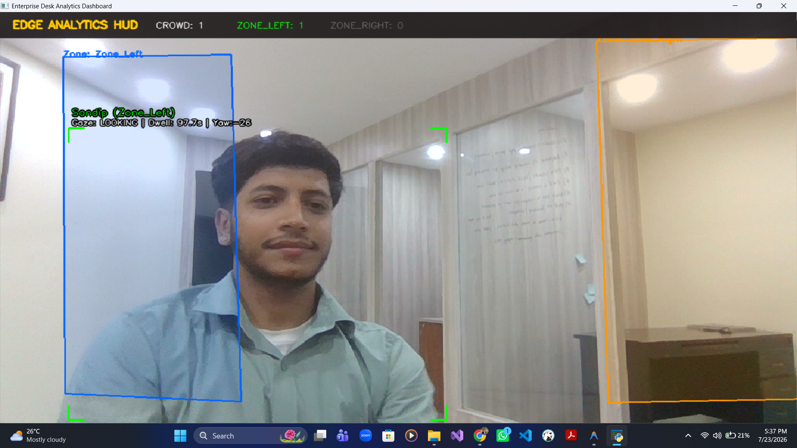
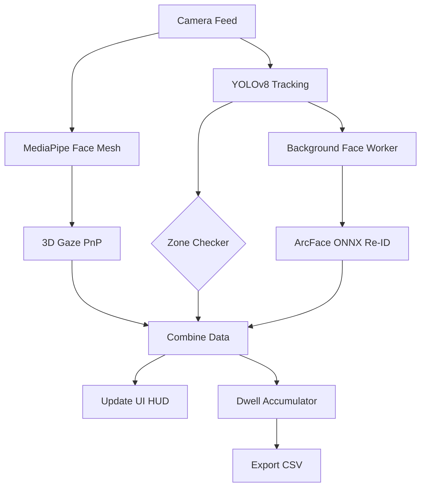
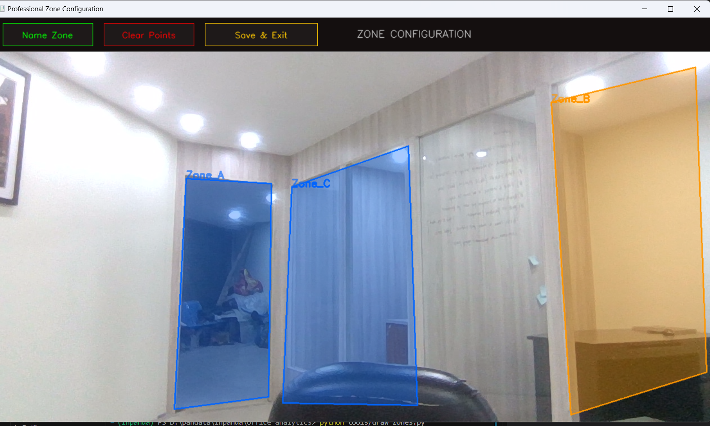
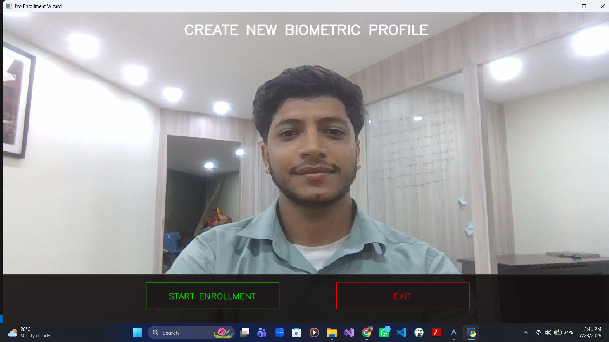

# Enterprise Edge Desk Analytics



An edge-optimized, real-time computer vision pipeline for employee tracking, zone-based dwell time analysis, and gaze estimation. Designed specifically for deployment on edge AI hardware (like Raspberry Pi 5 with AI cameras), this system operates entirely locally without requiring cloud GPU processing.

## 🌟 Features

*   **Real-Time Tracking (YOLOv8)**: Robust person detection and tracking using lightweight YOLO models configured to reject background hallucinations.
*   **Biometric Re-Identification (ArcFace)**: Automatically identifies tracked individuals using a lightweight MobileFaceNet ONNX model (5.2MB). Features a robust background threading system that continually retries identification until a lock is achieved.
*   **Multi-Shot Face Enrollment**: Built-in wizard UI to capture Center, Left, and Right facial angles, creating a highly accurate "Master Template" resistant to lighting or angle changes.
*   **3D Gaze Estimation**: Hybrid PnP mathematical approach using MediaPipe Face Mesh. Accurately determines if an employee is directly interacting with the camera, calibrated specifically for downward laptop/webcam viewing angles.
*   **Dynamic Spatial Zones**: Draw custom polygons (e.g., `Zone_Left`, `Zone_Right`) on the camera feed. The system uses homography to align zones even if the camera is slightly bumped, and precisely calculates multi-point intersections (Chest, Center, Feet, Edges) to determine occupancy.
*   **Analytics Export**: Automatically pauses timers when an employee leaves the frame and resumes upon their return. Pressing `ESC` securely exports all spatial and gaze dwell times to a dynamic `analytics_report.csv`.
*   **Enterprise HUD**: Minimalist, glass-morphic Top-Bar UI overlay providing real-time data without obstructing the camera feed.

## 🏗️ Architecture Flow



## 🚀 Edge Deployment Guide (Raspberry Pi 5)

This pipeline is aggressively optimized for CPU/Edge execution using `ONNXRuntime (CPUExecutionProvider)` and `TFLite/XNNPACK`.

### Prerequisites
1.  **Hardware:** Raspberry Pi 5 (8GB recommended) + Pi Camera Module 3 or USB AI Webcam.
2.  **OS:** Raspberry Pi OS (64-bit).

### Installation
1.  Clone the repository:
    ```bash
    git clone https://github.com/SandipAcharya/Employee_Supervision.git
    cd Employee_Supervision
    ```
2.  Create a virtual environment and install dependencies:
    ```bash
    python3 -m venv env
    source env/bin/activate
    pip install opencv-python numpy mediapipe ultralytics onnxruntime
    ```
    *(Note: On Raspberry Pi, you may need to install `libgl1-mesa-glx` via apt-get for OpenCV).*

## 🛠️ Usage

### 1. Define Analytics Zones
Run the zone configuration tool to draw custom analytics areas on your camera feed.
```bash
python tools/draw_zones.py
```
*   Click to draw points. Click `Name Zone` to save the polygon. Click `Save & Exit` when finished.



### 2. Enroll Employees
Run the multi-shot enrollment wizard to create biometric profiles.
```bash
python tools/enroll_face.py
```
*   Click `START ENROLLMENT`.
*   Follow the on-screen UI prompts to look Center, Left, and Right.



### 3. Start Live Analytics
Launch the main enterprise pipeline.
```bash
python main_live.py
```
*   The system will track employees, calculate zone dwell times, and monitor gaze interaction.
*   Press `ESC` at any time to gracefully shut down the system and generate the `analytics_report.csv`.

## 📊 Sample Output (`analytics_report.csv`)

| Employee ID | Total Camera Looks | Time Looking (s) | Total Zone Dwell (s) | Zone_Left Dwell (s) | Zone_Right Dwell (s) |
| :--- | :--- | :--- | :--- | :--- | :--- |
| Sandip | 15 | 34.2 | 120.5 | 110.5 | 10.0 |
| Sapana | 8 | 12.1 | 45.0 | 0.0 | 45.0 |

---
*Created by [Sandip Acharya]*
